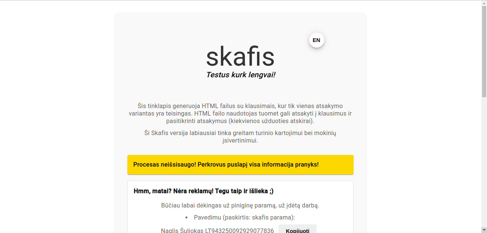
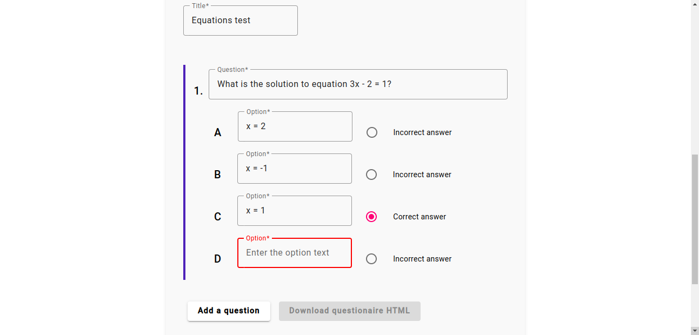
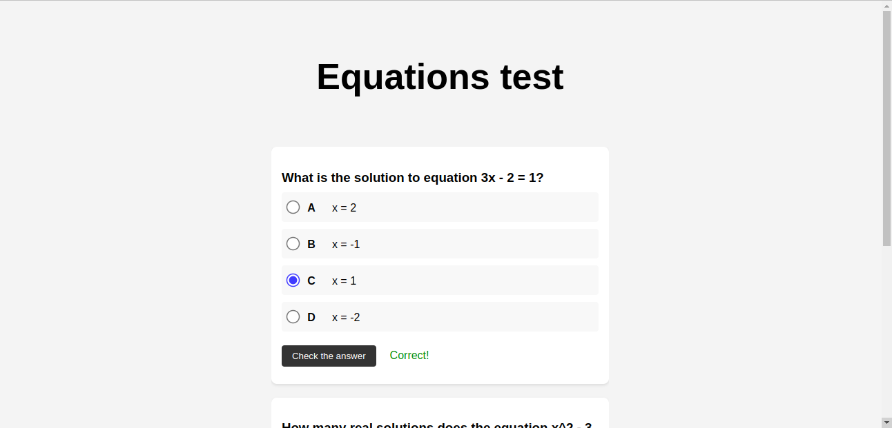
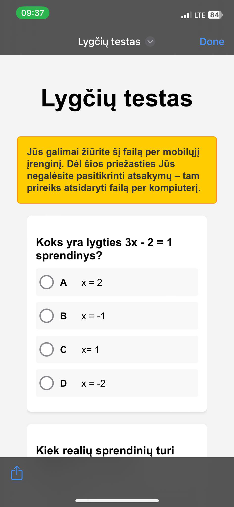

# Skafis

Website for teachers to make tests and assignments - both online and to print.

You can find the website deployed here: [https://www.skafis.com](https://www.skafis.com)

Currently v1.0.1 which means website can only generate HTML files with single choice questions for students to be able to check answers immediately.

## Screenshots

## Tech

- Angular
- Angular Material
- AWS Amplify and S3

## How to run locally (dev)

Prerequisites:

- Installed Nodejs
- Installed yarn (`npm install --global yarn`)

Run locally:

- `yarn` - install all npm packages
- `yarn start` - runs on http://localhost:4200 also available from any device in the network.

## HTML generation

Code was copied here [https://www.freeformatter.com/javascript-escape.html](https://www.freeformatter.com/javascript-escape.html) and then pasted to the code as a constant string.

## Version plan

1. Only one choice test, only text questions/answers > html which requires name and then it generates a file (signed or something with encryption so can't be forged).
2. Multiple choice, insert text, latex questions/answers > html or pdf with answer sheet.
3. Insert pictures, drawn problems, check answers from html generated file.
4. Host generated test with link, sends answers to teacher, check answers also with a link for teachers.
5. Kahoot type quiz demonstration.

Started developing 2024-03-30 19:30 with absolutely no experience with Angular. Only with react and ChatGPT :D 2024-04-02 I already have v1.0.0 which I am really proud of :D (and it wasn't 24/7 coding, just a lot of chatGPT help).

## Money

skafis.com domain 12.30 EUR for 1 year (Hostinger).

AWS is complicated.

Idea is to buy the domain, start hosting on AWS for what is free tier and hope to gather money from donations to payback the domain and a little bit forward for the AWS pricing. And then track how much is spent on website and how much money received from donations.

All of that while paying taxes as for "Individuali veikla" form FR0468.

Under code 856000, since this is what a person on a phone from "Valstybės duomenų agentūra" told me. And then I just added this to already existing "individualios veiklos pažyma" and gonna be writing "sąskaitas faktūras" for each person sending me money on Revolut.
